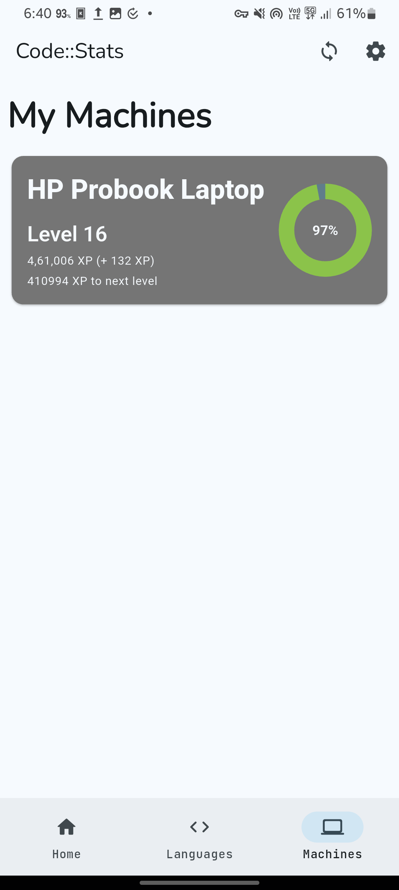

# CodeStats Client 📊

A sleek mobile client for viewing your Code::Stats analytics and tracking your coding journey. Currently displays your programming languages, experience levels, XP, and development machines.

## 🚀 Upcoming Features

- [ ] Home Screen Widgets
- [ ] Top Languages Dashboard
- [ ] Language Progress Tracking
- [ ] Activity Heatmap
- [ ] Machine Statistics
- [ ] Daily XP Tracking
- [ ] Streak Notifications
- [ ] Shareable Achievement Badges

## ⚡️ Quick Links

[Visit Code::Stats](https://codestats.net/) - The original service that powers this client.

> This is a community-built client app created with ❤️ for developers who want to track their coding progress. Not officially affiliated with Code::Stats.

## 📱 Screenshots

  

    
    
    
    
    
  

  

    <em>Left to right: Home Page, Languages, Machines, Settings, Home Page (Dark Mode)</em>
  

